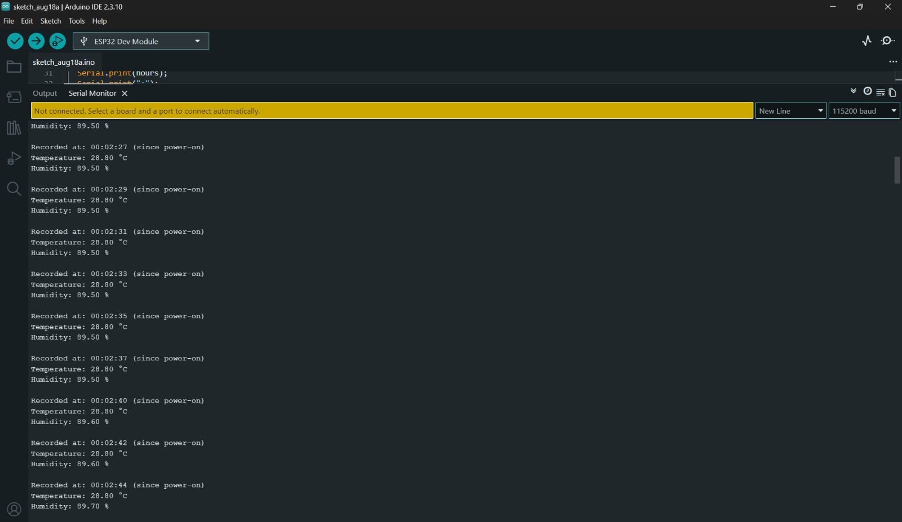
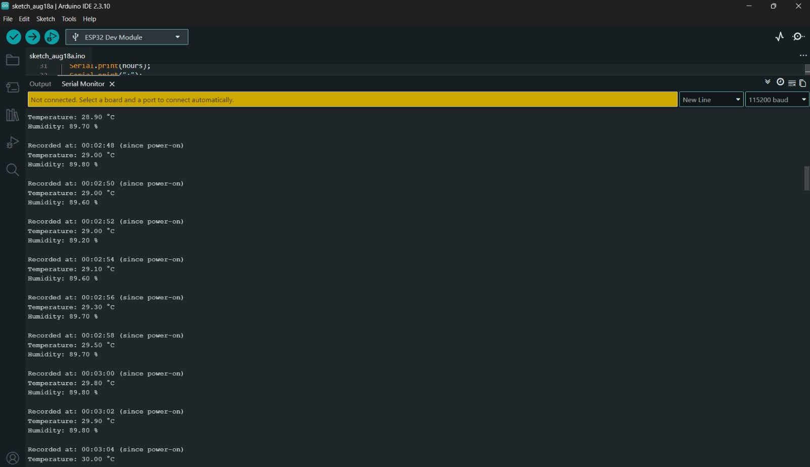

# 🌡️ DHT11 Temperature & Humidity Monitor

An ESP32-based sensor project that reads **temperature and humidity** using a DHT11 sensor and displays the readings in the Serial Monitor with the elapsed time since power-on.

## Project Overview

The DHT11 measures the surrounding temperature and humidity. The ESP32 reads the sensor data and displays it every 2 seconds.

A simple heat test can also be performed by bringing a nearby heat source close to the sensor and observing the temperature increase.

## Components Used

* ESP32 38-Pin Development Board
* DHT11 3-Pin Sensor Module
* Breadboard
* Jumper Wires

## Pin Connections

| DHT11   | ESP32  |
| ------- | ------ |
| **+**   | 3.3V   |
| **OUT** | GPIO 4 |
| **−**   | GND    |

## How It Works

```text
DHT11 Sensor
     ↓
Measures temperature & humidity
     ↓
ESP32 reads sensor data
     ↓
Serial Monitor displays readings
     ↓
New reading every 2 seconds
```

Example:

```text
Recorded at: 00:02:44
Temperature: 28.80 °C
Humidity: 89.70 %
```

The timestamp shows the **elapsed time since the ESP32 was powered on**.

## Sensor Test

### Normal Temperature



### Temperature Hike



The temperature reading increased when a nearby heat source was brought close to the DHT11 sensor.

## Concepts Learned

* DHT11 sensor
* Temperature and humidity sensing
* Digital sensor input
* `DHT.h` library
* `millis()` for elapsed time
* Serial Monitor
* Real-world sensor testing
